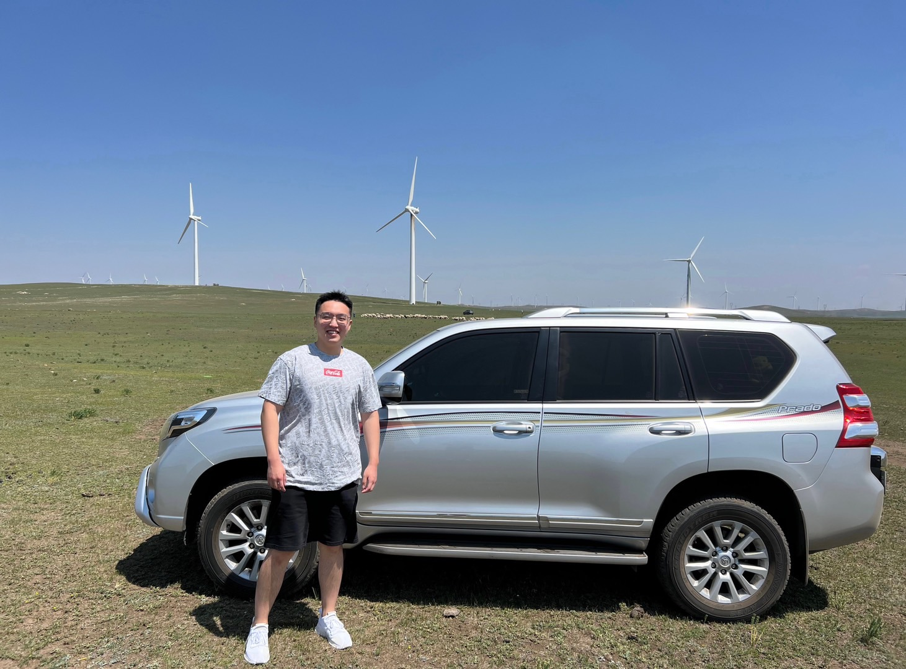

(A picture taken in Huitengxile Grassland in the North of China)

I am a graduate student who is pursuing the master degree of Applied Mathematics at Columbia University in the City of New York. I took my undergraduate study (Class of 2022) with mathematics major at University of California, Santa Barbara. 

The courses I've taken during my undergraduate and gradute study include algebra (linear and abstract algebra), analysis (real, complex and applied analysis), Partial Differential Equations, Complex Variables, Probability and Statistics (Probability Theory), Numerical Method and Scientific Computing.
